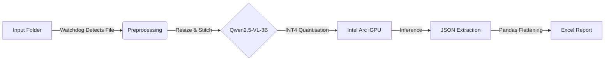

# Local Edge AI Invoice Processor (PoC)

**A private, offline-first approach to automated finance workflows using Vision-Language Models (VLMs) on consumer hardware.**

> *"The future is already here — it's just not evenly distributed."*

---

## 1. Project Overview

This project demonstrates that high-accuracy document extraction does not require massive cloud infrastructure. By leveraging **Edge AI** principles and modern model quantisation, a 3 Billion parameter Vision-Language Model can run directly on a standard business laptop.

**Key Capabilities:**
- **Privacy-First:** No data ever leaves the local device. Zero cloud API calls.
- **Zero-Cost Inference:** Runs entirely on local silicon (NPU / GPU / CPU).
- **Format Agnostic:** Handles PDFs (digital & scanned), JPGs, and PNGs.
- **Structured Output:** Converts unstructured visual data into strict JSON and flattened Excel reports.

---

## 2. Architecture

The system uses a lightweight **Watchdog architecture** to minimise resource usage, only activating accelerated compute when work is detected.



---

## 3. Optimisation Strategy (The “Secret Sauce”)

Running a 3B parameter Vision-Language Model on consumer hardware with shared system memory (RAM / VRAM) requires aggressive optimisation.

This project applies **4-bit quantisation (INT4)** using the OpenVINO™ toolkit.

| Model Format | Approximate Size | Practical Outcome |
|--------------|------------------|-------------------|
| FP16         | ~7.0 GB          | Impractical for most integrated GPUs |
| INT4        | ~1.8 GB          | Runs smoothly on 16–32 GB systems |

**Why INT4 matters:**
- Reduced memory pressure on shared GPUs
- Faster cold starts
- Stable inference without GPU starvation
- Suitable for always-on background workloads

---

## 4. Hardware Requirements

Benchmarked on an “80% standard business laptop” configuration:

- **CPU:** Intel Core Ultra 7 (Meteor Lake) or equivalent
- **GPU:** Intel Arc Graphics (Integrated) or NVIDIA RTX 3050+
- **RAM:** 16 GB minimum (32 GB recommended)
- **Storage:** ~5 GB SSD space for model weights and environment

---

## 5. Technology Stack

- **Language:** Python 3.10+
- **Inference Engine:** Intel OpenVINO™ with Hugging Face Optimum
- **Model:** Qwen2.5-VL-3B-Instruct (Vision-Language Model)
- **PDF Rendering:** `pypdfium2`
- **Data Processing:** `pandas`, `openpyxl`
- **Image Handling:** `Pillow`

---

## 6. Installation & Setup

### Step 1: Clone the repository or create a working folder

```bash
git clone <repository-url>
cd <repository-folder>
```

### Step 2: Create a virtual environment (recommended)

```bash
conda create -n edge_ai python=3.10
conda activate edge_ai
```

### Step 3: Install dependencies

```bash
pip install torch torchvision --index-url https://download.pytorch.org/whl/cpu
pip install optimum[openvino] auto-gptq
pip install pypdfium2 pandas openpyxl pillow
```

---

## 7. Usage

The system is controlled through the `invoice_bot.py` entry point and supports three operating modes.

### Mode A: Watchdog (Default)

Runs continuously in the background and processes files when new documents appear in the `invoices_input` folder.

Includes a **GPU safety check** to avoid interfering with other activities such as video calls or gaming.

```bash
python invoice_bot.py
```

### Mode B: One-Time Batch

Processes all existing files in the input directory once, then exits. Suitable for historical backfills or audits.

```bash
python invoice_bot.py --once
```

### Mode C: Force Run (Server Mode)

Bypasses GPU safety checks and processes immediately.

```bash
python invoice_bot.py --force
```

---

## 8. Sample Output

**Input:**  
A raw PDF invoice containing multiple line items and mixed tax rates.

**Output (JSON):**

```json
{
  "invoice_number": "INV-2024-001",
  "line_items": [
    {
      "description": "Consulting Services",
      "quantity": 10,
      "unit_price": 150.00,
      "gst_rate": "9%",
      "gross_amount": 1635.00
    }
  ],
  "invoice_totals": {
    "total_excluding_gst": 1500.00,
    "total_gst_amount": 135.00,
    "total_including_gst": 1635.00
  }
}
```

The extracted JSON is subsequently flattened into an Excel-compatible format using `pandas`.

---

## 9. Disclaimer

This project is a **Proof of Concept (PoC)** intended to demonstrate the feasibility of local, offline Edge AI for document processing.

It is not a replacement for:
- Enterprise ERP systems
- Formal accounting controls
- Centralised governance frameworks

All extracted results should be reviewed and validated by a human operator before use in production workflows.
